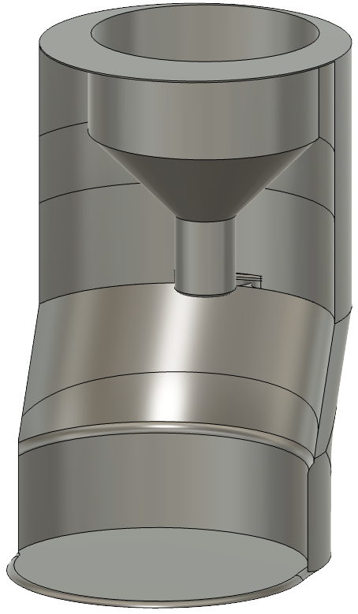
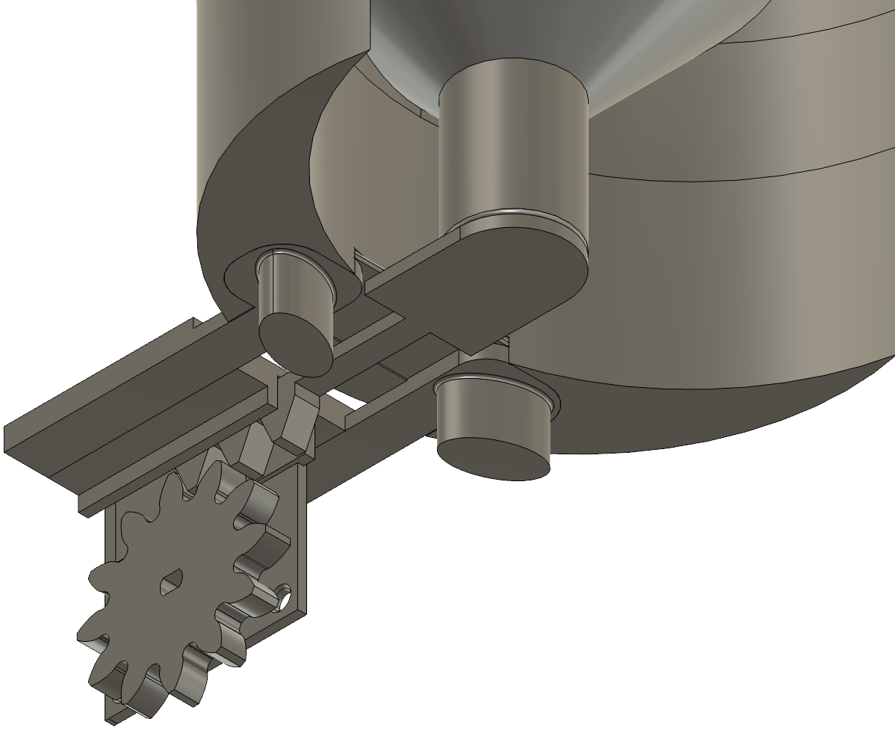

# Computer-Vision-Cat-Feeder
 

Allows a Raspberry Pi to drive a motor which controls a food hopper to refill food. Analyzes the amount of food remaining in the food bowl using OpenCV and Picamera2. Hosts an API with Flask to fetch the data samples.

## How to install
-todo-

## How it works
-todo-

## How to setup
Hardware:
 - Raspberry Pi 3+ (tested with Raspberry 4 Model B)
 - A Raspberry Pi compatible 1080p camera
 - One limit switch
 - A ULN2003 stepper motor driver
 - A 28BYJ-48 5V stepper motor
 - Bright white LEDs
 - 3D printed parts, will release later

Install the camera in to the ribbon cable slot on the Raspberry Pi board.  
Wire up the limit switch to the respective pin you chose in `core.py`.  
Wire up the stepper motor to the motor driver.  
Wire the motor driver to the respective pins for the motor phases in `core.py`.  
Wire the white LEDs to the pin you chose in `core.py`.  
Place a platform on top of the limit switch.  
Mount the camera above the platform facing downward.  
Place the food bowl in the food shelf and position in front of platform.
